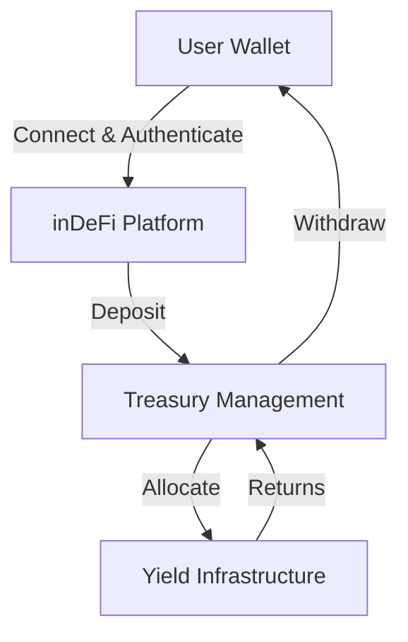

# Platform Overview

inDeFi.io operates as a managed web platform utilizing blockchain settlement infrastructure. Users interact with a web-based application, managed allocation systems, treasury operations, and internal risk-management infrastructure.

## Core Principles

<CardGroup cols={2}>
  <Card title="Centralized Management" icon="building-columns">
    Professional oversight of all treasury and allocation operations
  </Card>

  <Card title="Blockchain Settlement" icon="link">
    Utilizing blockchain networks for secure, transparent transactions
  </Card>

  <Card title="Duration-Based Allocations" icon="clock">
    Structured lock-up periods rather than speculative products
  </Card>

  <Card title="Risk Management" icon="shield">
    Disciplined treasury deployment and capital efficiency
  </Card>
</CardGroup>

## What inDeFi is NOT

The platform does not offer decentralized governance functionality or permissionless financial protocol interaction:

- **No governance token exists**
- **No DAO governance exists**
- **No autonomous user-directed smart contract interaction model exists**

## Operational Objectives

The platform's objective is to provide users with streamlined access to professionally managed digital asset yield infrastructure while emphasizing:

| Objective | Description |
| --- | --- |
| Treasury Management | Centralized oversight of capital allocation and reserves |
| Operational Stability | Consistent, reliable platform operations |
| Liquidity Management | Controlled liquidity oversight and capital efficiency |
| Infrastructure Security | Robust security measures and operational safeguards |

## Platform Architecture

<Info>
  All digital asset allocations involve risk. inDeFi does not guarantee profits or fixed returns.
</Info>