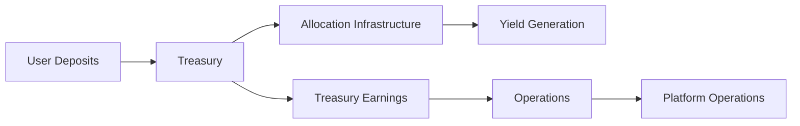

# Allocation Model

Rather than presenting users with numerous individual products, inDeFi organizes allocations primarily around lock-up duration structures.

## Supported Assets

The platform currently supports allocations using:

<CardGroup cols={2}>
  <Card title="USDC" icon="circle-dollar">
    USD Coin - A fully reserved, regulated stablecoin backed 1:1 by US dollars
  </Card>

  <Card title="USDT" icon="circle-dollar">
    Tether - The most widely adopted stablecoin in the cryptocurrency ecosystem
  </Card>
</CardGroup>

<Note>
  Support for additional digital assets, including ETH and BTC, may be introduced in future platform expansions.
</Note>

## Duration-Based Structure

inDeFi's allocation model is built around lock-up duration rather than individual speculative products:

| Duration Type | Liquidity | Yield Potential | Use Case |
| --- | --- | --- | --- |
| **Short-term** | Higher | Moderate | Users needing flexibility |
| **Medium-term** | Balanced | Balanced | General treasury allocation |
| **Long-term** | Lower | Higher | Capital stability optimization |

<Info>
  Longer-duration allocations may provide higher target yield opportunities due to increased capital stability and treasury planning efficiency.
</Info>

## Gamma Vault

The platform's flagship allocation program is currently referred to as the **Gamma Vault**.

Over time, the platform is transitioning toward a broader duration-based allocation structure rather than emphasizing individual allocation names or internal operational methodologies.

## Treasury Segmentation

Operationally, assets are managed through internal treasury segmentation frameworks:

This structure improves:

- **Liquidity oversight** - Clear visibility into available liquidity
- **Operational accounting** - Accurate tracking of all asset movements
- **Treasury coordination** - Efficient capital deployment
- **Platform scalability** - Foundation for growth

<Warning>
  Users do not directly manage or control backend treasury operations. All treasury management is handled by the inDeFi operational team.
</Warning>

## Risk Disclosure

<Warning>
  **Important:** inDeFi does not guarantee profits or fixed returns. All digital asset allocations involve risk, including the possible loss of principal.
</Warning>