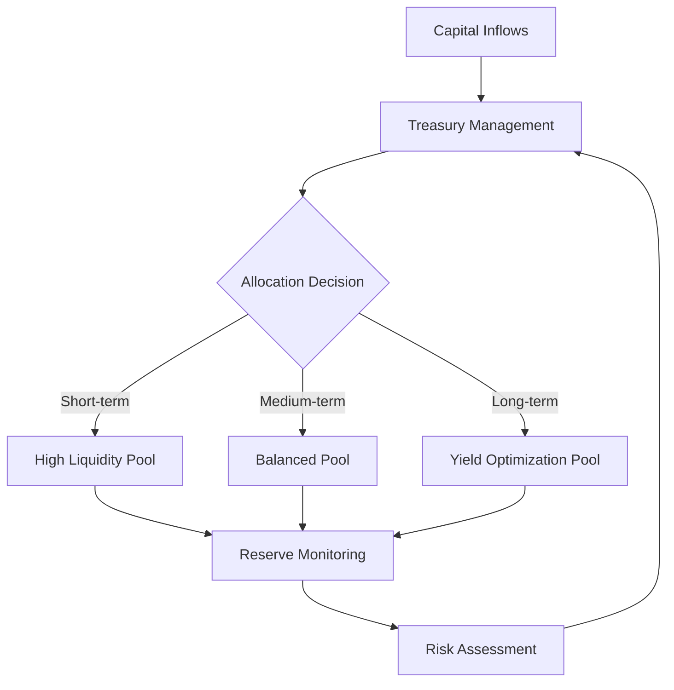

# Treasury Management Philosophy

Risk management and treasury management are core operational functions of indeFi.io. The platform prioritizes operational continuity, liquidity management, capital efficiency, and infrastructure resilience.

## Core Principles

<CardGroup cols={2}>
  <Card title="Operational Continuity" icon="rotate">
    Consistent, reliable platform operations without interruption
  </Card>
  <Card title="Liquidity Management" icon="water">
    Controlled oversight of available capital and withdrawal capacity
  </Card>
  <Card title="Capital Efficiency" icon="chart-pie">
    Optimized deployment of treasury assets
  </Card>
  <Card title="Infrastructure Resilience" icon="server">
    Robust systems designed to withstand operational challenges
  </Card>
</CardGroup>

## Operational Philosophy

The objective of the platform is **not** speculative trading exposure, but rather:

- **Disciplined treasury deployment**
- **Managed digital asset allocation**
- **Professional oversight of all operations**

## Core Operational Principles

| Principle | Description |
|-----------|-------------|
| Controlled Liquidity Management | Careful oversight of available liquidity across all timeframes |
| Capital Reserve Oversight | Maintaining appropriate reserves for operational stability |
| Allocation Balancing | Strategic distribution across allocation infrastructure |
| Operational Monitoring | Continuous oversight of platform and treasury operations |
| Infrastructure Security | Robust security measures protecting all systems |

## Treasury Operations

## Risk Management Framework

indeFi employs a comprehensive risk management approach:

<Steps>
  <Step title="Capital Assessment">
    Continuous monitoring of capital positions and reserve levels
  </Step>
  <Step title="Liquidity Planning">
    Ensuring sufficient liquidity to meet user withdrawal demands
  </Step>
  <Step title="Allocation Review">
    Regular review of allocation strategies and performance
  </Step>
  <Step title="Operational Monitoring">
    24/7 monitoring of platform infrastructure and treasury operations
  </Step>
</Steps>

<Info>
The platform continuously evaluates and improves operational standards as infrastructure evolves. Specific internal methodologies and procedures are not publicly disclosed for security reasons.
</Info>
