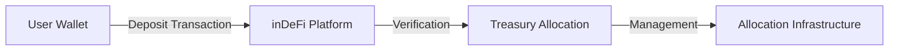
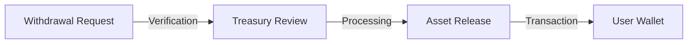

# Custody & Asset Flow

Understanding how your digital assets are handled within the inDeFi platform.

## Deposit Process

Users deposit supported digital assets through supported blockchain networks:

<Steps>
  <Step title="Connect Wallet">
    Connect your Web3 wallet to the inDeFi platform
  </Step>
  <Step title="Initiate Deposit">
    Select the amount and confirm the deposit transaction
  </Step>
  <Step title="Transaction Confirmation">
    Wait for blockchain confirmation of your deposit
  </Step>
  <Step title="Allocation">
    Assets are allocated to your selected duration structure
  </Step>
</Steps>

## Asset Management

Assets may subsequently be allocated across internal treasury and allocation infrastructure managed by the platform.

inDeFi maintains centralized operational oversight regarding:

| Function | Description |
| --- | --- |
| **Treasury Coordination** | Central management of all treasury operations |
| **Liquidity Management** | Oversight of available liquidity and reserves |
| **Allocation Administration** | Management of user allocations across structures |
| **Operational Accounting** | Accurate tracking of all asset movements |

## Custody Model

<Warning>
  **Important:** inDeFi does not represent itself as a self-custodial wallet provider.
</Warning>

When you deposit assets to inDeFi:

- Assets are transferred to platform-controlled infrastructure
- The platform manages allocation and treasury operations
- Users maintain the right to withdraw according to their allocation terms
- All operations are conducted under centralized oversight

## Withdrawal Process

Withdrawal availability depends on:

- Your allocation's lock-up duration
- Current liquidity conditions
- Platform operational status

<Info>
  Specific withdrawal procedures and timelines are outlined in your allocation terms at the time of deposit.
</Info>

## Blockchain Interactions

All deposits and withdrawals occur on-chain, providing:

- **Transparency** - Verifiable transaction history
- **Security** - Cryptographic transaction verification
- **Immutability** - Permanent record of all movements